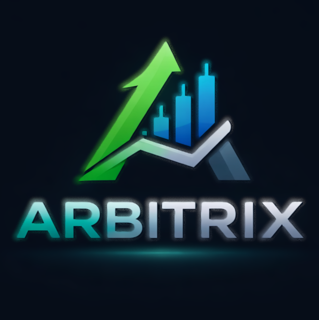

# ARBITRIX — AI Trader



### PIEC · RLFS · S-ADR Auto-Trading System

---

## What is ARBITRIX?

ARBITRIX is a paper-trading simulator for NSE (Indian) stocks, powered by three proprietary algorithms:

- **PIEC** (Physical Integrity Entropy Consensus) — measures market entropy (how directional vs random price moves are) and uses it to attenuate signal strength in chaotic regimes
- **RLFS** (Representation Learning Feature Stability) — tracks drift in the indicator feature vector over time; detects when your signals have shifted regime before you lose money
- **S-ADR** (Stability-Adaptive Degradation Response) — maps RLFS drift to position sizing (ω): full size in STABLE regime, scaled down in DEGRADED, no trade in REJECTED

Combined with RSI, MACD, EMA trend, Bollinger Bands, and volume analysis — plus Claude AI explanations for every trade.

---

## Project Structure

```
arbitrix/
├── index.html
├── package.json
├── vite.config.js
├── server/
│   ├── index.js          # Backend server (Node.js/Express)
│   ├── package.json      # Backend dependencies
│   └── .env              # Environment variables (MongoDB, API keys)
└── src/
    ├── main.jsx          # React entry point
    ├── App.jsx           # Main app: state, auto-scan engine, wiring
    ├── lib/
    │   ├── constants.js  # Design tokens, stock universe, helpers, and configurable parameters
    │   ├── ta.js         # Technical analysis: EMA, RSI, MACD, Bollinger, ATR
    │   ├── piec.js       # PIEC entropy + RLFS monitor + S-ADR (with configurable parameters)
    │   ├── analyze.js    # Full stock analysis combining TA + PIEC (with input validation)
    │   ├── fetch.js      # Yahoo Finance data fetcher (with backend proxy to avoid CORS)
    │   └── ai.js         # Claude API integration for trade reasoning (via backend proxy)
    └── components/
        ├── Setup.jsx         # Launch screen
        ├── WatchlistPanel.jsx # Left column: stock list + scan status
        ├── TradingPanel.jsx   # Centre: chart, signals, PIEC tab, buy/sell
        ├── HoldingsPanel.jsx  # Right: holdings + trade log
        ├── PriceChart.jsx     # Recharts price + EMA + Bollinger + forecast
        ├── ConfirmModal.jsx   # Auto-trade confirmation with AI reasoning
        ├── SettingsPanel.jsx  # Settings toggles
        └── UI.jsx             # Shared: badges, bars, toasts, spinners
```

---

## Quick Start

### Prerequisites

- Node.js 18+
- npm 8+

### Install & Run

```bash
# Install frontend dependencies
npm install

# Install backend dependencies
cd server
npm install
cd ..

# Create .env file in server/ with:
# PORT=5000
# MONGODB_URI=mongodb+srv://<username>:<password>@cluster0.xxx.mongodb.net/arbitrix?retryWrites=true&w=majority
# ANTHROPIC_API_KEY=your_anthropic_api_key
# JWT_SECRET=your_jwt_secret

# Start backend server
cd server
npm start
# Server will run on http://localhost:5000

# In a new terminal, start frontend
npm run dev

# Open http://localhost:3000 (or another port if 3000 is in use)
```

### Build for production

```bash
npm run build
# Output in /dist — serve with any static host
```

---

## Features

| Feature               | Description                                                          |
| --------------------- | -------------------------------------------------------------------- |
| Auto BUY/SELL         | Scans every 30s, queues trades based on PIEC signals                 |
| Confirm dialog        | Full PIEC breakdown + AI reasoning before each trade                 |
| Full auto mode        | Disable confirmations with ⚡ AUTO ALL                               |
| Per-direction toggles | Confirm buys but auto-sell (or vice versa)                           |
| Stop-loss auto        | Sells any position that drops 5% below avg buy price                 |
| AI pick reasoning     | Claude explains why these stocks suit your budget                    |
| AI trade notes        | Every manual trade gets a 3-sentence coaching note                   |
| PIEC tab              | Live entropy gauge, RLFS score, drift, ω sizing, return distribution |
| Signals tab           | Component breakdown with weights                                     |
| Price chart           | Historical + EMA21/50 + Bollinger + 10-day forecast                  |
| Real NSE data         | Yahoo Finance via backend proxy (mock fallback if blocked)           |
| Toast notifications   | Bottom-right trade alerts                                            |
| Portfolio analytics   | Holdings P&L, unrealised returns, stop-loss warnings                 |
| User Authentication   | Register, login, secure sessions with JWT                            |
| AI Control Modes      | Full AI control, Semi-AI control, Manual control                     |
| Dynamic Stock Suggestions | AI suggests stocks based on available capital                       |
| Strategy Monitoring   | RLFS+S-ADR to monitor strategy reliability and user behavior         |

---

## Settings

Access via ⚙ in the top bar:

- **Auto-Trading Engine** — on/off master switch
- **Confirm Before BUY** — popup before each auto-buy
- **Confirm Before SELL** — popup before each auto-sell
- **Show AI Reasoning** — calls Claude API for "why this stock"
- **Auto Stop-Loss (−5%)** — auto-sell at 5% loss
- **Toast Notifications** — bottom-right alerts
- **AI Control Mode** — Select: Full AI, Semi-AI, or Manual

---

## AI Control Modes

1. **Full AI Control** — The AI makes all trading decisions automatically (subject to risk limits)
2. **Semi-AI Control** — The AI suggests trades, and you confirm or reject each one
3. **Manual Control** — You make all trading decisions; AI provides analysis and suggestions only

Each AI suggestion includes a detailed explanation of:
- Why the stock was selected based on your capital and risk profile
- The technical and fundamental analysis supporting the suggestion
- How the PIEC, RLFS, and S-ADR algorithms influenced the decision
- Risk factors and suggested position sizing

---

## PIEC Algorithm Notes

### Entropy Calculation

Shannon entropy over K=8 directional bins of 30-day returns, normalised to [0, 1].

- Entropy = 0 → pure trend (all moves in one direction) → full signal weight
- Entropy = 1 → pure chaos (uniform distribution) → 40% signal attenuation

### RLFS Monitor

Feature vector: `[RSI_norm, MACD_norm, BB_position, EMA_spread, Volume_ratio]`

- EWMA drift with β=1.2, γ=0.25
- RLFS score = exp(−β × drift)

### S-ADR Thresholds

- drift ≤ 0.25 → STABLE, ω = 1.0 (full position)
- 0.25 < drift < 0.65 → DEGRADED, ω = linear interpolation
- drift ≥ 0.65 → REJECTED, no trade

---

## Recent Improvements

The codebase has undergone significant refactoring to improve maintainability, configurability, and reliability:

1. **Backend Proxy Server** — Eliminates CORS issues by routing API requests through a Node.js/Express server
2. **User Authentication System** — Secure registration, login, and session management with JWT
3. **AI Control Modes** — Three levels of AI involvement in trading decisions
4. **Constants Management** — All magic numbers extracted to `src/lib/constants.js` for easy configuration
5. **Parameter Configuration** — RLFS and S-ADR parameters (BETA, GAMMA, STABLE_THRESHOLD, REJECTED_THRESHOLD) are now configurable via exported constants
6. **Code Refactoring** — Split large functions into smaller, focused helpers (e.g., `executeTrade` split into `executeBuy` and `executeSell`)
7. **Input Validation** — Added validation to key functions like `analyzeStock` to handle edge cases
8. **Data Fetching Reliability** — Enhanced the Yahoo Finance data fetcher with backend proxy first, then fallback mechanisms
9. **Code Quality** — Improved readability with better section headers, comments, and consistent naming conventions

These improvements make the codebase more maintainable, easier to configure, and more reliable while preserving all existing functionality.

---

## Disclaimer

**Paper trades only. Not financial advice. Educational use.**

This system uses algorithmic signals that are not guaranteed to be profitable. The 10-day price prediction is an ensemble of technical indicators — not a crystal ball. Never trade real money based solely on algorithmic signals without understanding the risks.

---

## Built with

React + Recharts + Vite (frontend)
Node.js + Express (backend)
MongoDB Atlas (database)

---

## Future Development

This platform provides a solid foundation for implementing a full trading system as specified in the requirements, including:

- Real-time market data layer for both Indian (NSE/BSE) and international (US) markets
- User payment and funding system (Razorpay/Stripe integration)
- Brokerage trading layer (Alpaca, Zerodha, etc.)
- AI Strategy Engine (RLFS, S-ADR, PIEc) with machine learning model training
- Risk Management System with advanced controls (VaR, stress testing, etc.)
- Backend Infrastructure with proper database, caching, and message queues
- Frontend Dashboard with advanced analytics, strategy performance tracking, and withdrawal functionality
- Deployment to cloud platforms (AWS, GCP, Azure) with monitoring and alerting
- Mobile application extension (React Native)
- Social trading features and community strategies

The current implementation serves as a proof-of-concept and learning tool that can be extended to a production-ready system supporting both retail and potentially institutional clients.